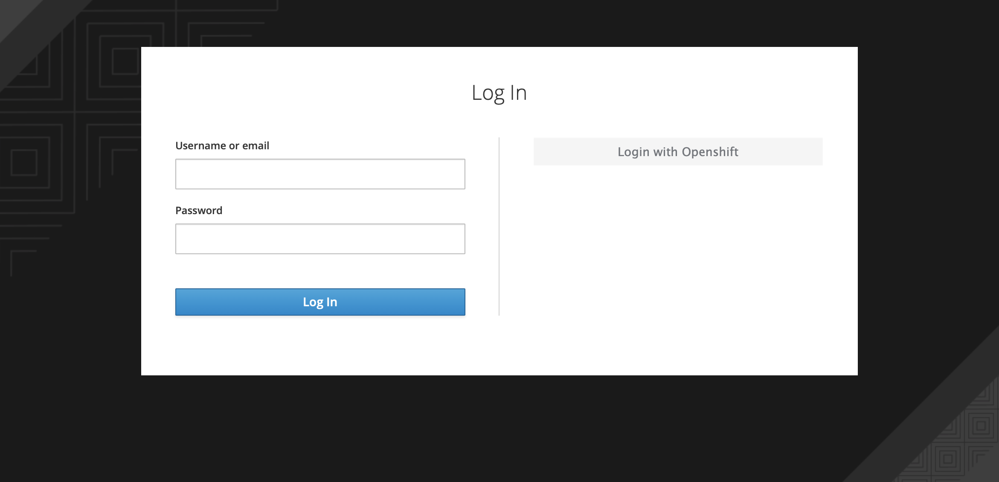
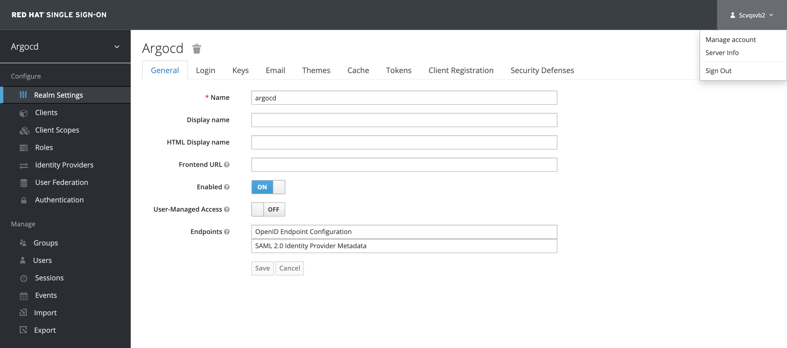

# Usage

This document describes the usage of Keycloak as a Single sign-on provider for ArgoCD in OpenShift Container Platform. Keycloak acts as an Identity broker between ArgoCD and OpenShift, Which means one can also login into Argo CD using their OpenShift credentials.

The following example shows the most minimal valid manifest to create a new Argo CD cluster with keycloak as a Single sign-on provider.

```yaml
apiVersion: argoproj.io/v1alpha1
kind: ArgoCD
metadata:
  name: example-argocd
  labels:
    example: basic
spec:
  sso:
    provider: keycloak
  server:
    route:
     enabled: true
```

## Create

Create a new Argo CD Instance in the `argocd` namespace using the provided example.

```bash
kubectl create -n argocd -f examples/argocd-keycloak.yaml
```

## Keycloak-Instance

The above configuration creates a keycloak instance and its relevant resources along with the Argo CD resources. Users can login into the keycloak console using the below commands.

Get the Keycloak Route URL for Login.

```bash
kubectl -n argocd get route keycloak
```

```bash
NAME   HOST/PORT                                                                PATH   SERVICES   PORT    TERMINATION   WILDCARD
keycloak    keycloak-default.apps.ci-ln-******.origin-ci-int-aws.dev.**.com          keycloak        <all>   reencrypt     None
```

Get the Keycloak Credentials which are stored as environment variables in the keycloak pod.

Get the Keycloak Pod name.

```bash
kubectl -n argocd get pods
```

```bash
NAME                                         READY   STATUS             RESTARTS   AGE
keycloak-1-2sjcl                                  1/1     Running            0          45m
```

Get the Keycloak Username.

```bash
kubectl -n argocd exec keycloak-1-2sjcl -- "env" | grep SSO_ADMIN_USERNAME
```

```bash
SSO_ADMIN_USERNAME=Cqid54Ih
```

Get the Keycloak Password.

```bash
kubectl -n argocd exec keycloak-1-2sjcl -- "env" | grep SSO_ADMIN_PASSWORD
```

```bash
SSO_ADMIN_PASSWORD=GVXxHifH
```

## Additional Steps for Disconnected OpenShift Clusters

In a [disconnected](https://access.redhat.com/documentation/en-us/red_hat_openshift_container_storage/4.7/html/planning_your_deployment/disconnected-environment_rhocs) cluster, Keycloak communicates with OpenShift Oauth Server through proxy. Below are some additional steps that needs to followed to get Keycloak integrated with OpenShift Oauth Login.

### Login to the Keycloak Pod

```bash
oc exec -it dc/keycloak -n argocd -- /bin/bash
```

### Run JBoss Cli command

```bash
/opt/eap/bin/jboss-cli.sh
```

### Start an Embedded Standalone Server

```bash
embed-server --server-config=standalone-openshift.xml
```

### Run the below command to setup proxy mappings for OpenShift OAuth Server host

```bash
/subsystem=keycloak-server/spi=connectionsHttpClient/provider=default:write-attribute(name=properties.proxy-mappings,value=["<oauth-server-hostname>;http://<proxy-server-host>:<proxy-server-port>"])
```

### Stop the Embedded Server

```bash
quit
```

### Reload JBoss

```bash
/opt/eap/bin/jboss-cli.sh --connect --command=:reload
```

## Login

You can see an option to Log in via keycloak apart from the usual ArgoCD login.


Click on **LOGIN VIA KEYCLOAK**. You will see two different options for login as shown below. The one on the left will allow you to login into argo cd via keycloak username and password. The one on the right will allow you to login into argo cd using your openshift username and password.



You can create keycloak users by logging in to keycloak admin console using the Keycloak admin credentials.

**NOTE:** Keycloak instance takes 2-3 minutes to be up and running. You will see the option **LOGIN VIA KEYCLOAK** only after the keycloak instance is up.

By default any user logged into ArgoCD will have read-only access. User level access can be managed by updating the argocd-rbac-cm configmap.

The below example show how to grant user foobar with email ID `foobang@example.com` admin access to ArgoCD. More information regarding ArgoCD RBAC can be found [here](https://argoproj.github.io/argo-cd/operator-manual/rbac/)

```yaml
policy.csv: |
  g, foobang@example.com, role:admin
```

## Change Keycloak Admin Password

You can change the Keycloak Admin Password that is created by the operator as shown below.

Login to the Keycloak Admin Console using the Admin user as described in the above section. Click on the user drop-down at the top right and click on the `Manage Account`.



Click on the `Password` tab to update the Keycloak Admin Password.


## Uninstall

You can delete the Keycloak resources and its relevant configuration by removing the SSO field from ArgoCD Custom Resource Spec.

Example ArgoCD after removing the SSO field should look something like this.

```yaml
apiVersion: argoproj.io/v1alpha1
kind: ArgoCD
metadata:
  name: example-argocd
  labels:
    example: basic
spec:
  server:
    route:
     enabled: true
```

Note: Keycloak application created by this feature is currently not persistent. Incase of restarts, Any additional configuration created by the users in ArgoCD Keycloak realm will be deleted.
